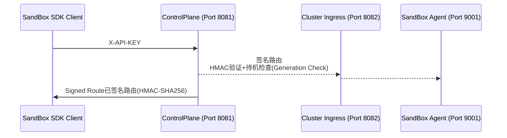

#### omni-env

sandbox 3层网络架构模型
- 北向流量：sandbox内sdk与管控面通信（创建沙箱、续约、hmac-sha256路由签名）
- 南向流量：管控面向Worker集群内的sandbox agent发起execute请求（/chat/completions）
- 网管层：OpenResty Gateway（北向）+ 集群Ingress（南向）分开处理

```mermaid
sequenceDiagram
    participant A as SandBox SDK Client
    participant B as ControlPlane (Port 8081)
    participant C as Cluster Ingress (Port 8082)
    participant D as SandBox Agent (Port 9001)
    
    A->>B: X-API-KEY
    B-->>C: 签名路由<br/>HMAC验证+待机检查(Generation Check)
    C-->>D: 
    B->>A: Signed Route已签名路由(HMAC-SHA256)
```